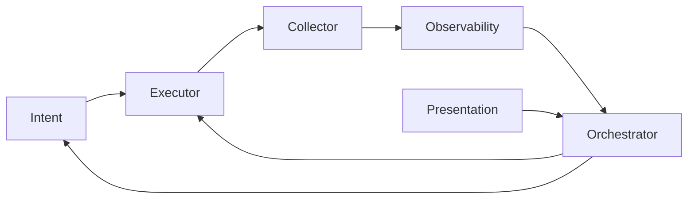

# ADR-0001: NAF Building Block Architecture

## Status

Accepted

## Date

2026-04-14

## Context

snapl is a modular network automation prototype that needs a clear architectural structure for organizing code across different automation concerns (source of truth, deployment, collection, monitoring, orchestration, user interface).

The Network Automation Forum (NAF) defines a reference framework with six building blocks that describe the functional components of any network automation system:

1. **Intent** — desired state and source of truth
2. **Executor** — configuration deployment
3. **Collector** — live network data retrieval
4. **Observability** — drift detection, metrics, audit
5. **Orchestrator** — workflow coordination
6. **Presentation** — user-facing CLI / API

These building blocks form a feedback loop: Intent defines desired state, the Executor deploys it, the Collector retrieves actual state, Observability compares actual vs. desired and detects drift, the Orchestrator coordinates remediation, and the cycle repeats.

We needed a principled way to decompose the codebase that would:
- Prevent tight coupling between automation concerns
- Allow independent development and testing of each block
- Map directly to industry-standard terminology
- Support multiple use cases (datacenter fabric, client edge, SD-WAN, WAN) within the same structure

## Decision

We adopt the NAF Framework's six building blocks as the top-level architectural decomposition, implementing each block as an independent Python package within a uv workspace monorepo.

### Package Structure

```
packages/
├── intent/          # snapl-intent       (snapl_intent)
├── executor/        # snapl-executor     (snapl_executor)
├── collector/       # snapl-collector    (snapl_collector)
├── observability/   # snapl-observability (snapl_observability)
├── orchestrator/    # snapl-orchestrator (snapl_orchestrator)
└── presentation/    # snapl-presentation (snapl_presentation)
```

### Contract-First Interfaces

Each package exposes a public interface through an abstract base class (ABC) and Pydantic models:

| Package | ABC | Key Methods |
|---------|-----|-------------|
| `snapl_intent` | `IntentStore` | `get_desired_state()`, `get_schema()`, `seed()` |
| `snapl_executor` | `Executor` | `apply()`, `rollback()`, `dry_run()` |
| `snapl_collector` | `Collector` | `collect()`, `get_running_config()` |
| `snapl_observability` | `Observer` | `detect_drift()`, `emit_event()`, `log_audit()` |
| `snapl_orchestrator` | (Temporal workflows) | Composes the above ABCs |
| `snapl_presentation` | (CLI/API) | User-facing commands |

### Dependency Direction

Dependencies flow in one direction with no circular imports:

```
presentation -> orchestrator -> {intent, executor, collector, observability}
observability -> collector
executor -> intent
```

### Diagram



## Consequences

### Positive
- Each building block can be developed, tested, and versioned independently
- Dependency direction is enforced by the package structure — circular imports are caught immediately
- Terminology aligns with NAF, making the project accessible to network automation engineers
- Adding a new use case (e.g., WAN automation) means adding implementations within existing blocks, not new architectural layers
- ABCs define clear contracts; implementations can be swapped (e.g., different SoT backends)

### Negative
- Six packages adds management overhead compared to a single package
- Cross-block changes require coordinating updates across multiple packages
- New contributors must understand the NAF framework to navigate the codebase effectively
- The uv workspace monorepo pattern is less mature than single-package setups
