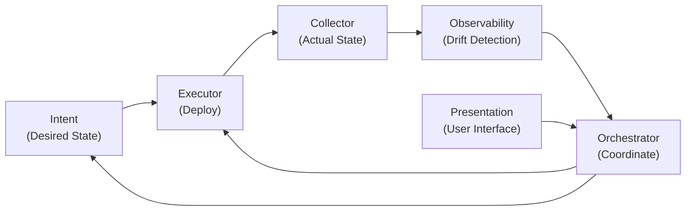

# NAF Framework — Network Automation Forum Building Blocks

## Overview

The Network Automation Forum (NAF) defines a reference framework for network automation systems. snapl implements this framework's six building blocks as independent Python packages, forming a closed-loop automation system.

## The Six Building Blocks

### 1. Intent

**Package:** `snapl_intent`

The Intent block defines and stores the **desired state** of the network. It is the source of truth (SoT) for what the network should look like.

Responsibilities:
- Store network schemas, inventory, and intended configuration
- Provide desired state to other blocks via a well-defined API
- Support version control and branching of intent data
- Manage seed data and schema loading

In snapl, Intent is backed by **Infrahub** (OpsMill) as the graph-native SoT.

### 2. Executor

**Package:** `snapl_executor`

The Executor block **deploys configuration** to network devices, translating desired state into device-specific commands.

Responsibilities:
- Accept desired state from Intent and deploy it to devices
- Support dry-run mode for validation before deployment
- Provide rollback capability for failed deployments
- Use protocol-specific adapters (gNMI for SR Linux, NETCONF, REST, etc.)

In snapl, the Executor uses **gNMI** (via pygnmi) to deploy YANG-modelled JSON to Nokia SR Linux devices.

### 3. Collector

**Package:** `snapl_collector`

The Collector block retrieves **actual state** from the live network — what the devices are currently running.

Responsibilities:
- Collect running configuration from devices
- Retrieve operational state (interface status, BGP sessions, counters)
- Normalize collected data into a format comparable with desired state
- Provide data to Observability for drift detection

### 4. Observability

**Package:** `snapl_observability`

The Observability block **compares actual state with desired state** and detects drift, emits events, and maintains audit logs.

Responsibilities:
- Detect configuration drift (actual != desired)
- Emit events when drift is detected
- Maintain audit logs of all changes and detections
- Provide metrics for monitoring (compliance ratios, orphaned rules, etc.)

### 5. Orchestrator

**Package:** `snapl_orchestrator`

The Orchestrator block **coordinates workflows** across the other blocks, ensuring operations happen in the correct order with proper error handling.

Responsibilities:
- Define durable workflows (deploy, validate, remediate)
- Compose Intent, Executor, Collector, and Observability into end-to-end pipelines
- Handle failures with compensation (saga pattern)
- Support time-bounded operational overrides

In snapl, the Orchestrator uses **Temporal** for durable workflow execution.

### 6. Presentation

**Package:** `snapl_presentation`

The Presentation block provides the **user interface** — CLI commands, API endpoints, or dashboards.

Responsibilities:
- Expose automation capabilities to users
- Provide CLI commands for common operations
- Offer API endpoints for programmatic access
- Display status, metrics, and audit information

## The NAF Feedback Loop

The building blocks form a continuous feedback loop:

```
Intent (desired state)
    |
    v
Executor (deploy to devices)
    |
    v
Collector (read actual state)
    |
    v
Observability (compare actual vs. desired, detect drift)
    |
    v
Orchestrator (coordinate remediation if drift found)
    |
    v
Back to Executor (re-deploy corrected config)
```



This loop runs continuously:
1. **Intent** defines what the network should look like
2. **Executor** pushes that configuration to devices
3. **Collector** reads what the devices are actually running
4. **Observability** compares actual vs. desired and flags drift
5. **Orchestrator** decides what to do about drift (auto-remediate, alert, log)
6. The cycle repeats

## Dependency Direction

Blocks depend on each other in a strict hierarchy:

```
presentation -> orchestrator -> {intent, executor, collector, observability}
observability -> collector
executor -> intent
```

- **Intent** and **Collector** are leaf nodes — they depend on no other snapl packages
- **Executor** depends on Intent (needs desired state to deploy)
- **Observability** depends on Collector (needs actual state to compare)
- **Orchestrator** depends on all four core blocks
- **Presentation** depends only on Orchestrator

Circular dependencies between packages are forbidden.

## How Blocks Communicate

Blocks communicate through their ABC interfaces and Pydantic models:

1. The Orchestrator instantiates concrete implementations of each block's ABC
2. Data flows between blocks as Pydantic models (type-safe, validated)
3. The Orchestrator sequences operations: get desired state -> deploy -> collect -> compare
4. Results flow back to Presentation for display

## Use Cases

The same six blocks support multiple network automation use cases:

| Use Case | Intent Source | Executor Target | Collector Method |
|----------|--------------|-----------------|------------------|
| Datacenter Fabric | Infrahub schemas | SR Linux gNMI | gNMI GET |
| Client Edge | Infrahub schemas | SR Linux gNMI | gNMI GET |
| SD-WAN | Infrahub schemas | REST API | REST GET |
| WAN | Infrahub schemas | NETCONF | NETCONF GET |

Each use case provides its own concrete implementations of the ABCs while sharing the Orchestrator workflows and Observability logic.
